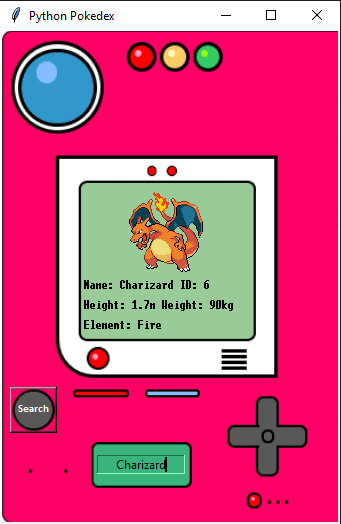
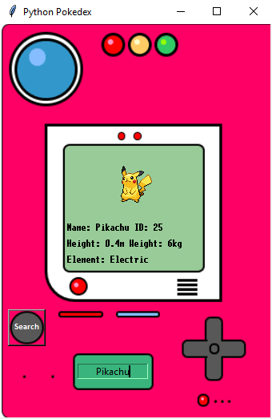

# 
Python Pokédex

I developed this Pokédex using Python's Tkinter module and The RESTful Pokémon API, I hope you like it 😊

Please install the requests module before starting

pip install requests

